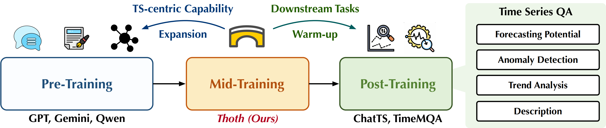

#  Thoth: Mid-Training Bridges LLMs to Time Series Understanding

[](https://arxiv.org/abs/2603.01042)
[](https://github.com/thuml/Thoth)
[](https://huggingface.co/thuml/Thoth-30B-A3B)

This is the official repository for the paper [Thoth: Mid-Training Bridges LLMs to Time Series Understanding](https://arxiv.org/abs/2603.01042).

## 📄 Introduction

While Large Language Models (LLMs) demonstrate exceptional proficiency in general reasoning, they often exhibit a fundamental limitation in capturing intricate temporal dependencies. To bridge this gap, **Thoth** introduces the first family of mid-trained LLMs that transcend the constraints of task-specific Supervised Fine-Tuning (SFT) through a **task- and domain-agnostic mid-training stage**. By leveraging an automated synthesis pipeline to achieve bidirectional alignment between time-series-to-text and text-to-time-series generation, Thoth equips models with an intrinsic and foundational understanding of temporal dynamics. This internalized comprehension enables the model to effectively address and enhance performance across a wide range of complex, knowledge-intensive time series reasoning downstream tasks in real-world scenarios.



For more details, please check our [paper](https://arxiv.org/abs/2603.01042).

## ✨ Quickstart

We have released [**Thoth-30B-A3B**](https://huggingface.co/thuml/Thoth-30B-A3B) on **Hugging Face**, a model fine-tuned from [Qwen3-30B-A3B-Instruct-2507](https://huggingface.co/Qwen/Qwen3-30B-A3B-Instruct-2507) that is ready for immediate inference and testing.

```python
import torch
from transformers import AutoModelForCausalLM, AutoTokenizer

model_id = "thuml/Thoth-30B-A3B"
tokenizer = AutoTokenizer.from_pretrained(model_id, trust_remote_code=True)
model = AutoModelForCausalLM.from_pretrained(model_id, device_map="auto", dtype=torch.bfloat16, trust_remote_code=True).eval()

# Your question here
question = """Your question here"""
messages = [
    {"role": "system", "content": "You are an expert in time series understanding and reasoning."},
    {"role": "user", "content": question}
]
text = tokenizer.apply_chat_template(messages, tokenize=False, add_generation_prompt=True)
model_inputs = tokenizer([text], return_tensors="pt").to(model.device)

# Generate reasoning output
generated_ids = model.generate(**model_inputs, max_new_tokens=2048, temperature=0.7)

response = tokenizer.batch_decode(generated_ids, skip_special_tokens=True)[0]
print(response)
```

## 💻 Installation

```bash
conda create -n thoth python=3.10
conda activate thoth
pip install -r requirements.txt
```

## 💬 Evaluation

Refer to the YAML files under `evaluation/configs/` for setup. Note that additional configurations (e.g., `api_key` and `base_url`) are required for proprietary models.

To start the evaluation with the default configuration, simply run:

```bash
cd evaluation
bash ./scripts/Thoth.sh
```

## 🚀 Release Progress

- [x] Thoth-30B-A3B model weights
- [x] public benchmark evaluation pipeline
- [ ] KnoTS benchmark
- [ ] KnoTS evaluation code

## 📜 Citation

If you find our work useful, please cite our paper as:

```bibtex
@article{lin2026thoth,
  title={Thoth: Mid-Training Bridges LLMs to Time Series Understanding},
  author={Lin, Jiafeng and Wang, Yuxuan and Wu, Jialong and Luo, Huakun and Pei, Zhongyi and Wang, Jianmin},
  journal={arXiv preprint arXiv:2603.01042},
  year={2026}
}
```

## 🤝 Contact

If you have any questions, feel free to contact:

- Jiafeng Lin (lin-jf21@mails.tsinghua.edu.cn)
- Yuxuan Wang (wangyuxu22@mails.tsinghua.edu.cn)
- Jialong Wu (wujialong0229@gmail.com)

## 💡 Acknowledgment

We sincerely appreciate the following works for their valuable open-source models and evaluation benchmarks:

- Qwen3 (https://github.com/QwenLM/Qwen3)
- Time-MQA (https://huggingface.co/datasets/Time-MQA/TSQA)
- ChatTime (https://github.com/ForestsKing/ChatTime)
- ChatTS (https://github.com/NetManAIOps/ChatTS)
